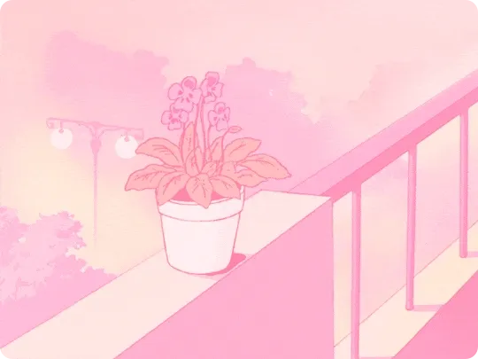

<h1 align="center">Hi, I'm Laura 👋</h1>

<h3 align="center">a passionate programmer from Finland 🇫🇮 — studying CS in Esbjerg, Denmark 🇩🇰</h3>

  

  

---

## 🌷 a little about me

- 🌱 studying **Computer Science** in Esbjerg, Denmark
- 💬 ask me about **code — or anything, really!**
- 🌐 currently having fun **making websites**
- 📫 reach me at **shpakovalaura@gmail.com** · **laurashpakova05@gmail.com**

## 🛠️ languages & tools

  
  
  
  
  
  
  
  
  
  
  
  
  
  
  
  
  

## 📌 things i've built

  

  &nbsp;&nbsp;&nbsp;&nbsp;
  

## 🤝 connect with me

  
  

<i>thanks for stopping by 🌸</i>

